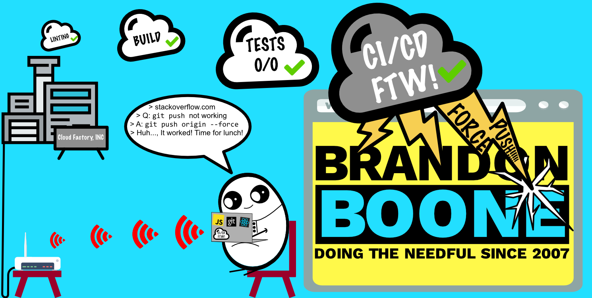

# Hi There 👋

My name is Brandon Boone. I'm a software enineer from the USA, working in the healthcare industry since 2007. You can find me on [![Twitter][1.2]][1],  or on [![LinkedIn][3.2]][3].

## 🔧 Technologies & Tools

## &#x1f4c8; GitHub Stats

<!-- links to social media icons -->

<!-- icons with padding -->

[1.1]: http://i.imgur.com/tXSoThF.png (twitter icon with padding)
[2.1]: http://i.imgur.com/0o48UoR.png (github icon with padding)

<!-- icons without padding -->

[1.2]: http://i.imgur.com/wWzX9uB.png (twitter icon without padding)
[2.2]: http://i.imgur.com/9I6NRUm.png (github icon without padding)
[3.2]: https://raw.githubusercontent.com/BrandonBoone/BrandonBoone/master/linkedin-3-16.png (LinkedIn icon without padding)

<!-- links to your social media accounts -->

[1]: https://twitter.com/brandonjboone
[2]: https://github.com/BrandonBoone
[3]: https://www.linkedin.com/in/brandonjboone/

<!--
**BrandonBoone/BrandonBoone** is a ✨ _special_ ✨ repository because its `README.md` (this file) appears on your GitHub profile.

Here are some ideas to get you started:

- 🔭 I’m currently working on ...
- 🌱 I’m currently learning ...
- 👯 I’m looking to collaborate on ...
- 🤔 I’m looking for help with ...
- 💬 Ask me about ...
- 📫 How to reach me: ...
- 😄 Pronouns: ...
- ⚡ Fun fact: ...
-->
